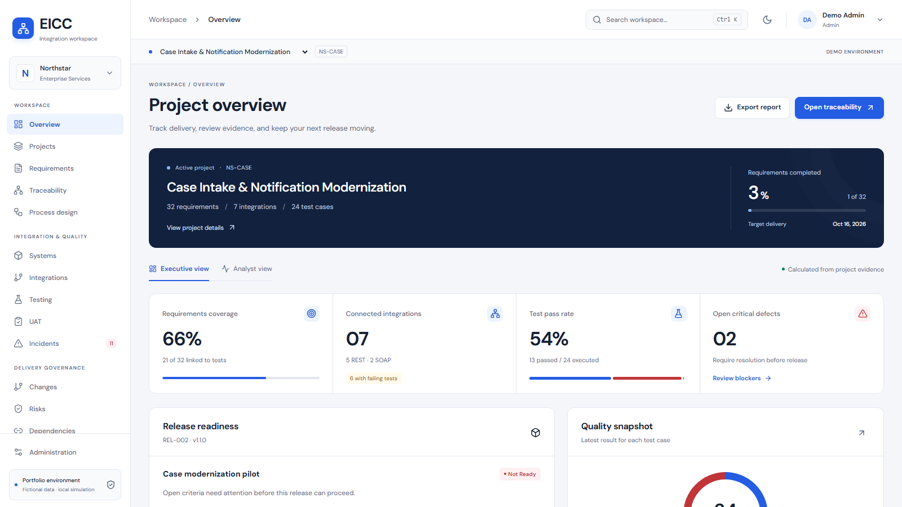
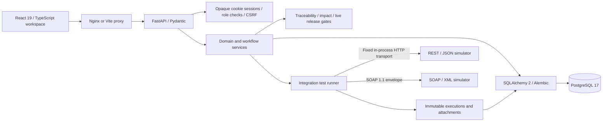
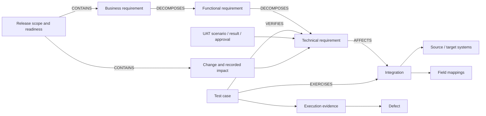
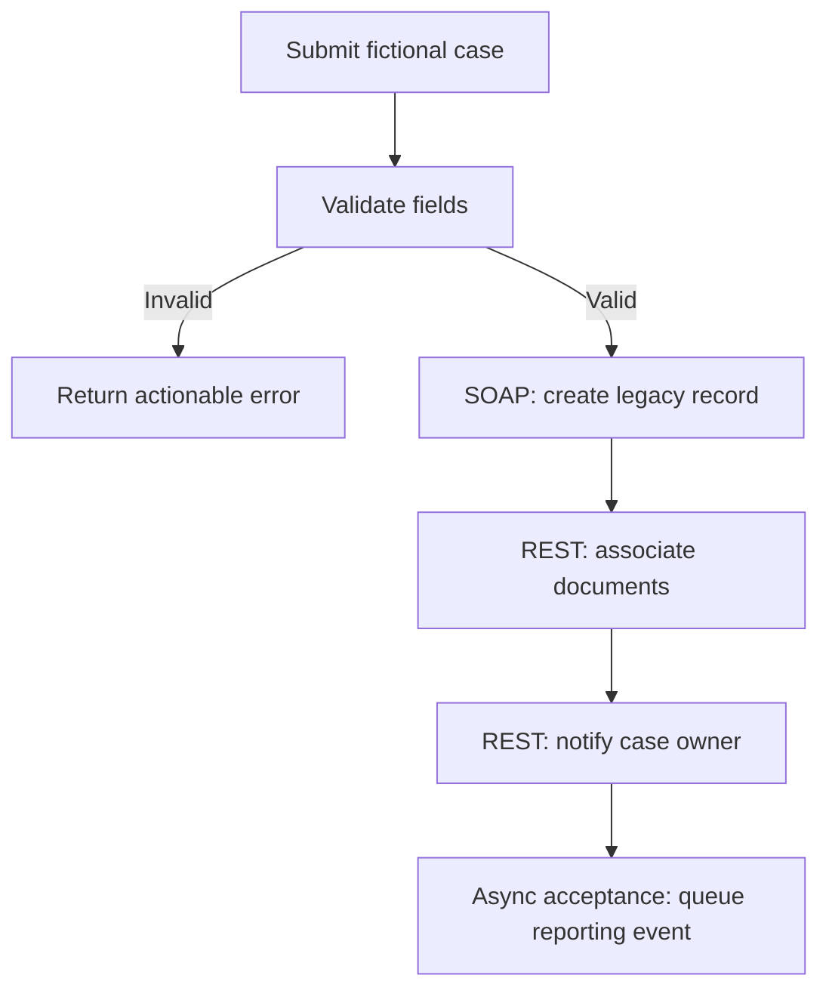

# EICC: Enterprise Integration Control Center

[MIT license](LICENSE) · [Source](https://github.com/MJA0211/eicc) · [Portfolio and demo](https://mawwad.dev/#eicc)

I built EICC to track an integration change from its requirements through tests, defects, acceptance, and release decisions. This personal project is still in development.

The demo follows a fictional case-intake project at Northstar Enterprise Services. Dashboards and release checks query stored records. The test runner sends HTTP requests to local REST/JSON and SOAP/XML simulators and saves the responses for review.

Northstar, its staff, and its release decisions are fictional. EICC has no affiliation with the Maryland Judiciary, any government organization, or ServiceNow. It has no real enterprise deployment or measured business outcomes.



**[Watch the recorded demo](docs/demo/eicc-walkthrough.mp4)** · [Browse the screenshot gallery](docs/screenshots/README.md) · [Demo chapters and transcript](docs/demo/transcript.md)

The captioned walkthrough follows a local SOAP failure through a mapping correction, passing retest,
stakeholder acceptance, change approval, and completed release. [Recording and reproduction details](docs/demo/README.md).

## Start the application

### Docker / PostgreSQL

Requirements: Docker Engine with Compose, and Python 3.11+ to generate private local configuration.

```sh
python scripts/init_env.py
docker compose up --build -d --wait
```

Open **http://127.0.0.1:8080**. Choose a demo role and enter the workspace. The backend migrates PostgreSQL,
seeds Northstar once, executes its 24 local protocol tests, and verifies the historical release automatically.
Subsequent starts preserve the data.

On Windows with Docker installed in Ubuntu WSL, the helper keeps WSL running while the containers are active:

```powershell
powershell -File scripts/start-docker.ps1
# Stop containers while retaining the PostgreSQL volume:
powershell -File scripts/stop-docker.ps1
```

The database and backend have no host-published ports. The frontend binds to loopback. The application containers
run as non-root users with read-only filesystems, dropped Linux capabilities, and writable temporary directories.
The password generated in `.env` is not printed and is excluded from Git and Docker build contexts.

### Local development / SQLite

Requirements: Python 3.11+, [uv](https://docs.astral.sh/uv/), and Node.js 22.

```sh
uv sync --frozen
uv run alembic upgrade head
uv run python -m backend.seed
npm --prefix frontend ci
```

Run these in two terminals:

```sh
uv run uvicorn backend.main:app --host 127.0.0.1 --port 8000
```

```sh
npm --prefix frontend run dev
```

Open **http://127.0.0.1:5173**. The API explorer is at **http://127.0.0.1:8000/docs**. The UI proxies API requests
to the backend. SQLite enforces foreign keys on every connection; it is the zero-service local development
option. PostgreSQL is the deployment database.

Windows helpers start the services in hidden windows and retain their process IDs and logs under `.local/`:

```powershell
powershell -File scripts/start-local.ps1
powershell -File scripts/stop-local.ps1
```

## The business problem

Northstar case operators re-enter data, associate documents manually, and send case-status messages by hand.
The fictional modernization project covers Case Intake, Legacy Records, Document
Management, Notification Service, Identity & Access, Reporting Warehouse, and External Partner Gateway.

The analyst needs to answer practical questions:

- Which business requirement explains this interface field?
- What changes if the legacy identifier contract changes?
- Which test produced this defect, and did the corrected contract pass a retest?
- Has the stakeholder accepted the current criteria?
- Which exact conditions prevent this release from proceeding?

## Architecture



This is a modular monolith. There are no microservices, outbound production API calls, shell-execution endpoints,
or AI approval paths. The frontend uses reusable panels, forms derived from typed API schemas, detail views,
responsive tables, native dialogs, local fonts, and light/dark themes.

| Area                                | Implementation                                             |
| ----------------------------------- | ---------------------------------------------------------- |
| Domain and persistence              | `backend/models.py`, `backend/db.py`, `migrations/`        |
| Validated contracts                 | `backend/schemas.py`; generated OpenAPI at `/openapi.json` |
| APIs and authorization              | `backend/main.py`, `backend/auth.py`, `backend/config.py`  |
| Workflow rules                      | `backend/services.py`                                      |
| Traceability and calculated gates   | `backend/graph.py`                                         |
| Local protocol execution            | `backend/simulator.py`                                     |
| Evidence files                      | `backend/evidence.py`                                      |
| Controlled documents                | `backend/reports.py`                                       |
| Reproducible scenario               | `backend/seed.py`                                          |
| Analyst workspace                   | `frontend/src/`                                            |
| Regression and browser verification | `tests/`, `frontend/e2e/`                                  |

## Domain model and traceability

The relational model uses a common artifact identity with joined subtype tables. Projects, stakeholders, processes, requirements, systems, integrations,
dependencies, risks, test plans/cases, UAT sessions/scenarios, incidents, changes, releases, training, and documents
have typed columns. Organization, mapping, execution, UAT result/approval, evidence attachment, session, user,
and audit tables hold their own records.

`artifact_links` has source and target foreign keys, a typed relation, a uniqueness constraint, and a self-link
constraint. Foreign keys connect a test to its requirement and integration subtype tables. The API rejects cross-project references and requirement decomposition cycles.



The matrix supports project, requirement, system, integration, test status, UAT status, and release filters.
Parent coverage rolls up tests on decomposed children. A requirement detail shows parents, children, affected
systems/integrations, tests and latest results, UAT, defects, changes, releases, risks, and dependencies.

Impact analysis traverses stored edges and foreign keys. It stops expansion at shared systems and delivery
containers so an unrelated release does not pull its entire scope into the result. The UI shows affected counts
and links; each result can be inspected through its persisted graph edges.

## Integration contracts and executable testing

The catalog documents endpoints, actions/methods, direction, synchronous/asynchronous mode, authentication design,
request/response contracts, mappings, linked requirements, tests, risks, dependencies, and known defects.



| Simulator                       | Contract                                                                           |
| ------------------------------- | ---------------------------------------------------------------------------------- |
| `POST /simulator/cases`         | Creates a local case; identical retry is idempotent; conflicting retry returns 409 |
| `GET /simulator/cases/{id}`     | Returns a persisted local case or 404                                              |
| `POST /simulator/notifications` | Returns simulated delivery or 202 queue acceptance; only `.test` recipients        |
| `POST /simulator/soap`          | Parses a SOAP 1.1 envelope and requires `case_id` with `xsi:type="xsd:string"`     |

Controlled scenarios cover successful responses, 400, 401, 404, 409, 500, and timeout. The runner uses an in-process HTTP client against the same FastAPI application. A controlled timeout has an 80 ms client deadline
against a slower fixture. This is a deterministic fault demonstration, not a production latency measurement.

Field transformations are a fixed allowlist: identity, string conversion, integer conversion, uppercase,
and lowercase. Missing required mapping inputs block execution. No mapping can evaluate code. Requests and
responses are retained unchanged with status, actor, timestamp, duration, and contract fingerprint.

Executions are append-only. A contract fingerprint binds a result to its test definition, payload, acceptance
criteria, integration contract, and mappings. Changed contracts require fresh execution; stale passes do not
satisfy release gates. Manual functional tests require substantive actual results and evidence.

Evidence files support PNG, JPEG, PDF, and UTF-8 text, up to 2 MiB each. Downloads require authentication and
are served as attachments with `nosniff`; filenames are sanitized and each file has a SHA-256 digest. The digest
supports integrity comparison, not an assertion of forensic authenticity.

## UAT, incidents, changes, and releases

UAT sessions progress from not ready through ready, in progress, evaluated, and stakeholder decision. Mandatory
scenarios need passing evidence before ordinary approval. An incomplete-criteria approval requires an explicit
override reason of at least 20 characters. Both the represented stakeholder and authenticated actor are retained.
Approval fingerprints become stale when acceptance definitions or their test evidence change.

Incidents and defects support New → Assigned → In Progress / Pending → Resolved → Closed, with reopening.
Failed executions can create a linked defect. Root cause and resolution are required for resolution; linked
test failures require a later passing execution against the current contract. The timeline includes changes,
investigation details, and passing retests.

Changes follow Draft → Submitted → Analysis → Pending Approval → Approved → Implementing → Validation →
Completed, with rejection paths. A recorded, current impact assessment is mandatory before approval. A manager
authorizes approval, and completion requires current passing evidence for impacted tests.

Releases contain explicit requirements and changes. Readiness is calculated every time it is requested:

| Mandatory gate                   | What must be true                                                       |
| -------------------------------- | ----------------------------------------------------------------------- |
| Requirements complete            | Scope is nonempty and every included/decomposed requirement is complete |
| Requirement test coverage        | Every leaf requirement has a mandatory test                             |
| Required tests executed          | Every mandatory test has evidence for the current contract              |
| Mandatory tests passing          | Every mandatory latest result is PASS                                   |
| UAT acceptance coverage          | Every leaf requirement has a relevant acceptance scenario               |
| UAT approval                     | Relevant sessions have a current stakeholder approval                   |
| Critical defects                 | No open critical defect affects the scope                               |
| Dependencies                     | No blocked dependency affects the scope                                 |
| Change validation                | Included changes are completed                                          |
| Rollback plan / deployment notes | Both contain substantive instructions                                   |

Open high-scoring risks produce an advisory warning. Failed mandatory criteria always produce **NOT READY**;
Ready, Deployed, and Completed transitions are rechecked on the server. A deployment transition records a
fictional delivery decision; it does not deploy external software.

## Demo roles and security

| Role          | Typical authority                                                         |
| ------------- | ------------------------------------------------------------------------- |
| Viewer        | Read and search                                                           |
| Analyst       | Author records, manage links/mappings, execute tests, record UAT results  |
| Tester        | Test plans/cases, execution evidence, defects, and UAT results            |
| Stakeholder   | UAT results and decisions                                                 |
| Manager       | Analyst actions plus requirement/change approvals and release transitions |
| Administrator | All workspace actions, including explicit demo reset                      |

Demo role selection is enabled only when `EICC_DEMO_MODE=true`. It is an exploration feature,
not a security boundary. For authenticated deployment, configure a private administrator email/password,
disable demo mode, enable secure cookies, and terminate HTTPS. Passwords use Argon2. Sessions use random opaque
tokens, store only token digests, expire, and can be revoked. Browser writes require a session-bound CSRF token
and an allowed origin. Record updates require `If-Match` with the current revision to reject stale edits.

Other controls include strict Pydantic input contracts, SQL parameterization, database constraints, body size
limits, safe XML parsing, authorization checks, no arbitrary outbound URLs, safe database-error responses,
security headers, and audit events. See [security and deployment](docs/security-and-operations.md).

## Documentation and reports

The app generates versioned Business Requirements Documents, Functional Requirements Documents, Integration
Specifications, Test Plans, UAT Plans, Release Notes, Training Guides, and Project Status Reports. Each is a stored
Markdown snapshot built from actual records, with controlled review status and an authenticated export.
Generate a new version when source records change; generated document content is immutable.

- [Guided demonstration](docs/demo-walkthrough.md)
- [Architecture and data decisions](docs/architecture.md)
- [Business analyst portfolio case study](docs/portfolio-case-study.md)
- [Capability-to-test traceability](docs/requirements-traceability.md)
- [Security, deployment, and operations](docs/security-and-operations.md)
- [Verification report](docs/verification.md)
- [Engineering delivery report](docs/engineering-report.md)
- [UI design and redesign verification](docs/ui-design.md)

## Verification

```sh
uv run ruff check .
uv run ruff format --check backend tests migrations scripts
uv run pytest --cov=backend --cov-report=term-missing
uv run pip-audit
npm --prefix frontend run build
npm --prefix frontend audit --audit-level=low
```

```sh
cd frontend
npx playwright install chromium
npm test
```

Browser tests start an isolated, freshly migrated and seeded backend on port 8001 and Vite on port 4173.
They do not mock the API. The main API workflow constructs a fresh business-to-release chain; browser tests
exercise authoring, SOAP failure/fix/retest, UAT evidence and attachments, change approval, release transitions,
search, filtering, exports, keyboard access, mobile layout, and an axe accessibility check.

Run the same backend suite against isolated schemas in the Compose PostgreSQL server:

```sh
docker compose -f docker-compose.yml -f docker-compose.test.yml run --build --rm tests
```

To run the browser suite against the built Docker application, set `EICC_BASE_URL=http://127.0.0.1:8080` before
running `npm test` in `frontend`. This suite writes fictional test records and requires an enabled demo environment.
GitHub Actions runs lint, backend tests, dependency audits, frontend builds, browser tests, Compose startup,
PostgreSQL tests, and browser tests against the containerized app. Required failures fail their jobs.

## Reproducible demonstration data

The Northstar definitions include 8 business, 12 functional, 8 technical, and 4 non-functional requirements;
7 systems; 7 integrations; 24 test cases; 6 risks; 6 dependencies; 3 changes; 6 UAT scenarios; and 2 releases.
Executions create actual failure records, including schema mismatch, rejected authentication, timeout,
incorrect mapping, and downstream error. The historical release is completed only after its local gates pass.
The pilot intentionally remains not ready.

The seed uses fixed definitions, relationships, and fault patterns. Execution timestamps, generated record keys,
session tokens, and measured durations are runtime values. Seeded UAT sign-off is explicitly marked as fictional
illustrative acceptance, not a claim that an actual stakeholder reviewed the project.

An administrator can use **Administration → Reset Demo Data**, type `RESET NORTHSTAR DEMO`, and restore the
Northstar project. The reset preserves other projects, users, sessions, and audit history; it reruns local tests
and rebuilds baseline acceptance and release evidence.

## Scope and limitations

This is a portfolio demonstration, not a production enterprise platform. OAuth2 and mutual TLS are integration
design metadata; local simulator authorization uses EICC sessions. Async notification/reporting demonstrates
queue acceptance, not an external broker, delivery worker, or email service. Documents are Markdown exports,
not signed legal records. File uploads are bounded and validated but are not malware-scanned. Audit records are
append-only through the API, not protected against a privileged database administrator.

Roles apply across this fictional organization; production multitenancy, per-project access control, SSO/MFA,
external object storage, distributed rate limits, highly available queues, and compliance certification are
outside this demonstration. Human approval remains authoritative. Nothing calls real Judiciary or production
enterprise systems, and no time savings, cost savings, adoption, or real-world experience is fabricated.

## License and contributions

EICC is licensed under the [MIT License](LICENSE), copyright 2026 Muhammed Awwad. Dependency and bundled font licenses remain in effect.

You can fork the code and propose changes through a pull request. Repository write access is limited to the owner; proposed changes require owner review. See [CONTRIBUTING.md](CONTRIBUTING.md) for setup and checks.

I used [Humanizer](https://github.com/blader/humanizer) and [Stop Slop](https://github.com/hardikpandya/stop-slop) to edit the documentation and interface text.

## Implementation references

Implementation research used the official [FastAPI security guidance](https://fastapi.tiangolo.com/tutorial/security/oauth2-jwt/),
[SQLAlchemy constraints](https://docs.sqlalchemy.org/en/20/core/constraints.html),
[SQLite foreign-key guidance](https://docs.sqlalchemy.org/en/20/dialects/sqlite.html#foreign-key-support),
[Playwright web-server setup](https://playwright.dev/docs/test-webserver), and
[Docker Engine installation documentation](https://docs.docker.com/engine/install/ubuntu/).
DM Sans is bundled locally through Fontsource; its package license is retained with the dependency.
