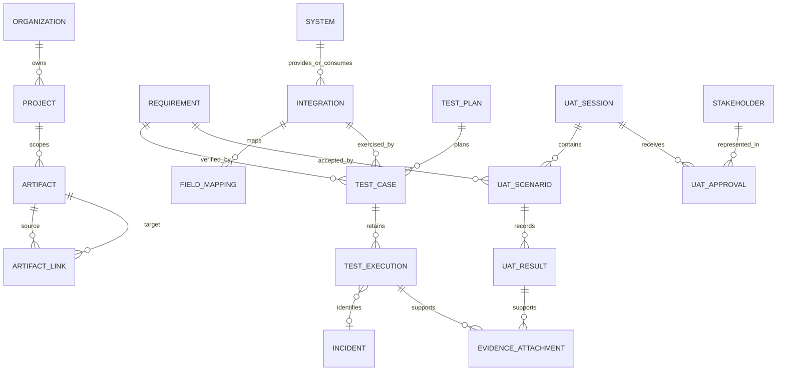

# Architecture and data decisions

## Boundaries

EICC is one application with an explicit separation between validated HTTP contracts, domain rules, graph
queries, relational storage, local protocol fixtures, and the React presentation layer. Nginx serves the built
frontend and proxies the API. PostgreSQL stores deployed data; SQLite supports local development and fast tests.

The simulator receives in-process HTTP requests through `httpx.ASGITransport`. This exercises routing,
authentication, request parsing, Pydantic validation, mapping, protocol handling, response serialization, and
evidence persistence without accepting an arbitrary network host. It intentionally does not measure network,
TLS, broker, or production-service behavior.

## Normalized identity and subtype tables

`artifacts` stores a globally unique human key, type, title, project, owner, workflow status, timestamps, and
optimistic revision. Seventeen joined subtype tables store their own domain fields. Shared identity allows a
foreign-key-backed `artifact_links` table to connect any supported artifact while enforcing referential integrity.

Domain-specific foreign keys connect integrations to source/target systems, test cases to plans/requirements/
integrations, UAT scenarios to sessions/requirements, and evidence/approvals to their parent records. JSON stores
structured process steps, payloads, audit snapshots, and analyzed graph snapshots; it does not replace core entities.

## Workflow consistency

Create schemas exclude workflow status. Updates also reject status, internal approval fields,
unknown properties, cross-project changes, and stale revisions. Dedicated transition endpoints enforce explicit
state graphs and permission rules. Database exceptions are converted to conflict responses; successful mutations
and their audit records commit together.

Execution evidence is immutable through the API. Re-execution creates a new row. The latest row determines test
state only if its contract fingerprint matches the current test and interface. Approval snapshots reference
current scenario definitions, requirements, and test evidence. A late contract change therefore cannot silently
reuse an earlier test pass or stakeholder approval.

Release membership is explicit. Decomposition expands the included requirement hierarchy, and its tests, UAT,
defects, risks, and dependencies form the gate scope. Shared systems are shown as impact context without pulling
every unrelated project integration into a release. Mandatory failure returns NOT READY, including empty scope.
Advisory high-risk warnings remain visible and do not claim that risks were mitigated.

## Operational decisions

Alembic migrations are checked by upgrading an empty database, downgrading, upgrading again, and comparing the
result with the SQLAlchemy metadata. PostgreSQL test runs create and drop dedicated `eicc_test_*` schemas per
test, preserving the deployed demonstration schema. Browser tests use a temporary database by default.

The seed writes definitions before running HTTP tests. Startup stops if evidence
initialization fails. Explicit demo reset removes the Northstar scope in referential order, preserves other
projects, reruns the simulators, and records a reset event. It is a demo operation, not a general database restore.

Pagination is supported on domain collection APIs. The workspace bootstrap currently loads the selected
organization's portfolio-sized catalogs; large production installations would require server-side selection
throughout the UI and additional query optimization. The current bootstrap suits the small demo dataset; production-scale query performance has not been measured.
