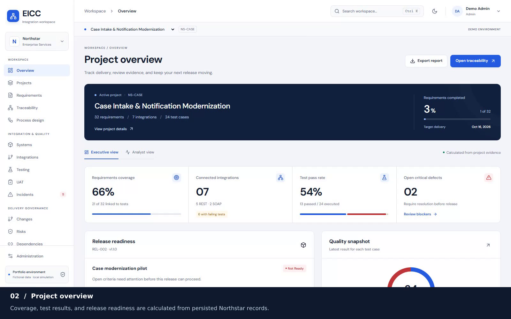

# Recorded EICC demonstration

[**Play or download the MP4**](eicc-walkthrough.mp4) · [Open the chapter player](index.html) · [Transcript](transcript.md) · [Screenshot gallery](../screenshots/README.md)

[](eicc-walkthrough.mp4)

The September 14, 2026 capture contains **22 app screenshots** and a **3 minute 26 second MP4** (1600 × 1000, 25 fps, approximately 13.5 MB), organized into **20 chapters**.

The silent recording includes explanatory captions, embedded MP4 chapter markers, and a separate WebVTT file. It shows the redesigned dashboard, dark theme, requirements, traceability, integration catalog, blocked release gates, and a complete SOAP failure-to-release workflow. Captions occupy a separate footer below the app; the application viewport is unchanged.

All records and decisions are fictional. The opening screens use Northstar seed data. The second part uses a separate qualification project: the script authors its definitions and reviews its requirements through the validated API before recording. The actual test failure, defect investigation, mapping correction, retest, requirement completion, UAT evidence and attachment, stakeholder approval, change approval, release transitions, and release-note generation happen through the browser on camera. No API responses are mocked. A recorded deployment transition does not deploy external software.

The recording uses a disposable SQLite database on ports 8001 and 4173. It does not reset or change the running Docker or local development workspace. The original browser recording is retained locally under `.local/demo-raw/`; the shareable MP4 and screenshots are repository files.

## View locally

Open `eicc-walkthrough.mp4` directly in a video player, or double-click `index.html` for the chapter player. To serve the player with HTTP, run this from the repository root:

```sh
python -m http.server 8090 --bind 127.0.0.1
```

Then open **http://127.0.0.1:8090/docs/demo/**. GitHub renders the Markdown gallery; download the MP4 or use a clone to view the interactive HTML player.

## Reproduce the assets

Install the application's Python/Node dependencies and Playwright Chromium as described in the root README. Install FFmpeg with the `libx264` encoder and `libass` filter, plus FFprobe, either on PATH or in Ubuntu WSL. On Ubuntu, `sudo apt-get install ffmpeg` provides these tools.

```sh
npm --prefix frontend run demo:capture
uv run python scripts/package_demo.py
npm --prefix frontend run demo:verify
```

Run only one browser suite at a time; recording reserves ports 8001 and 4173. The capture configuration deliberately ignores `EICC_BASE_URL` and refuses to reuse an existing server. Rerunning replaces the gallery and video assets with a new verified capture. The raw recording remains excluded from Git.

Ordinary regression tests save their screenshots in Playwright's test output directory, so running `npm test` preserves this curated repository gallery.

The capture test asserts the failed SOAP response, permanent mapping correction with unchanged input, retained failure/pass history, approval, completed release, passing mandatory gates, and mobile layout. Packaging checks the video format and chapter count and decodes the complete MP4. See [capture details](capture.json) and [artifact hashes, chapter timings, and verification](manifest.json). Runtime timestamps and execution durations vary between recordings.

[Playback verification](playback-verification.json) confirms that the local player loads and plays the MP4, seeks to a chapter, highlights it, fits the mobile viewport, and has no automated WCAG A/AA axe violations. All 25 recorded artifact hashes match. The six regression tests affected by screenshot output changes also passed; they cover the dashboard, SOAP correction, traceability and gates, keyboard and dark theme access, mobile navigation, and acceptance-to-release workflow.
